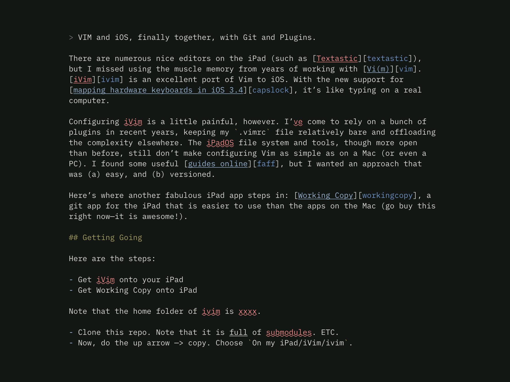

# This is my [iVim][ivim] setup. 

> VIM and iOS, finally together, with Git and Plugins.



There are numerous nice editors on the iPad (such as [Textastic][textastic]), but I missed using the muscle memory from years of working with [Vi(m)][vim]. [iVim][ivim] is an excellent port of Vim to iOS. With the new support for [mapping hardware keyboards in iOS 3.4][capslock], it’s like typing on a real computer.

Configuring iVim is a little painful, however. I’ve come to rely on a bunch of plugins in recent years, keeping my `.vimrc` file relatively bare and offloading the complexity elsewhere. The iPadOS file system and tools, though more open than before, still don’t make configuring Vim as simple as on a Mac (or even a PC). I found some useful [guides online][faff], but I wanted an approach that was (a) easy, and (b) versioned.

Here’s where another fabulous iPad app steps in: [Working Copy][workingcopy], a git app for the iPad that is easier to use than the apps on the Mac (go buy this right now—it is awesome!).

## Getting Going

Here are the steps:

- Get iVim onto your iPad
- Get Working Copy onto iPad

Note that the home folder of ivim is xxxx.

- Clone this repo. Note that it is *full* of submodules. ETC.
- Now, do the up arrow —> copy. Choose `On my iPad/iVim/ivim`.
- Lastly, make an `.vimrc` file in your 

## Updating changing:

```sh
[~/code/ivim]$ git submodule add plugins

```

```sh
git submodule deinit
git rm

```


[faff]: https://www.reddit.com/r/vim/comments/9ki5g8/ivim_ios_howtos/
[vim]: https://www.vim.org
[ivim]: https://github.com/terrychou/iVim
[textastic]: https://www.textasticapp.com
[capslock]: https://www.idownloadblog.com/2020/02/06/ipados-13-4-hardware-key-remapping/
[workingcopy]: https://workingcopyapp.com
